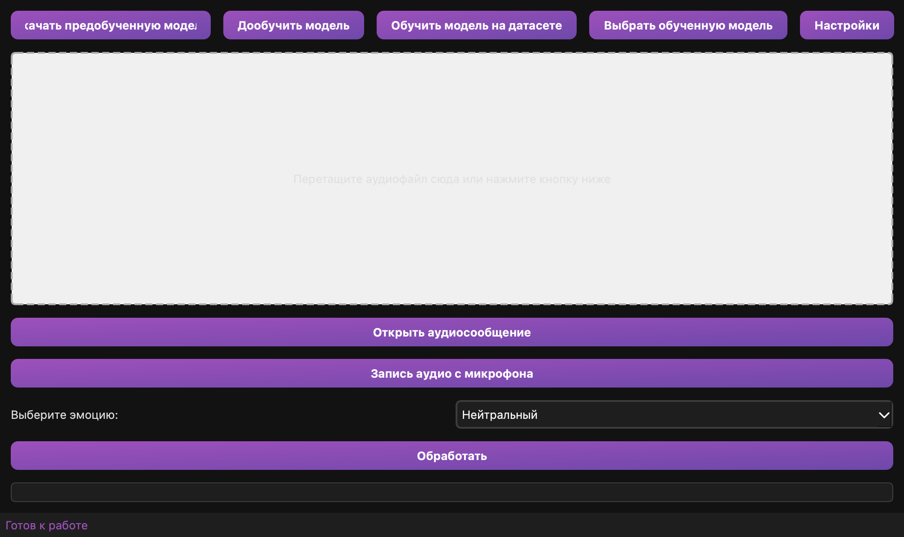
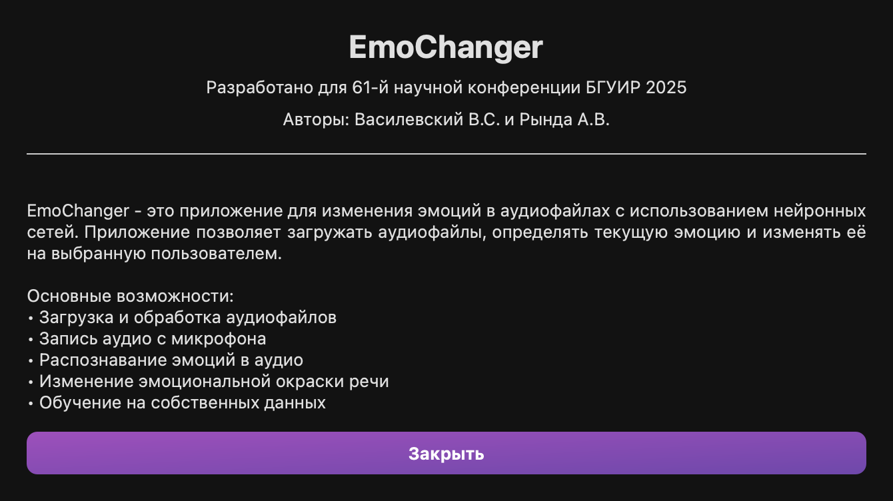
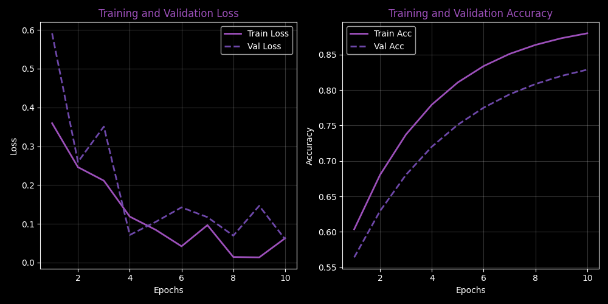
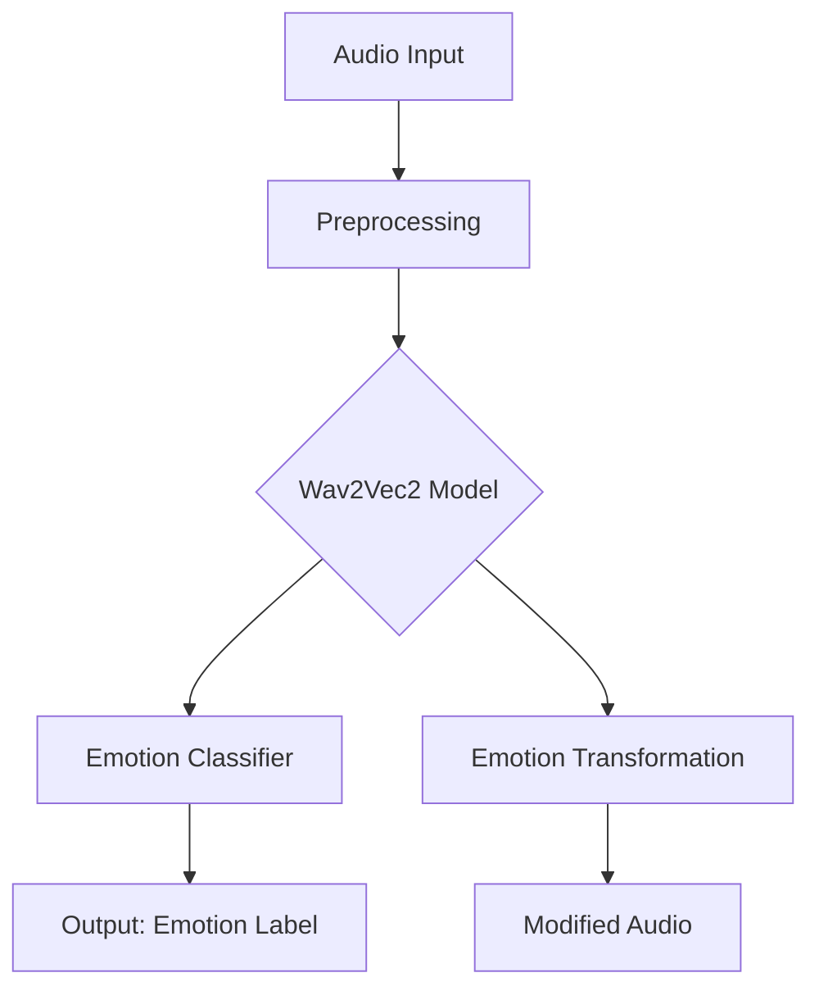

# 🎭 EmoChanger

[](https://www.python.org/downloads/)
[](https://pytorch.org/)
[](https://opensource.org/licenses/MIT)
[](#)

**EmoChanger** is a powerful, AI-driven application designed to analyze and transform emotional states in audio files. Leveraging state-of-the-art **Wav2Vec2** models, it provides seamless emotion recognition and conversion for researchers, developers, and creative professionals.

[English](#english) | [Русский](#русский)

---

<a name="english"></a>
## 🚀 Features

- **🎯 Precision Recognition:** Automatically detect emotions (Neutral, Happy, Sad, Angry, Fear) in any WAV audio.
- **🎙️ Real-time Recording:** Capture audio directly from your microphone for instant analysis.
- **🧠 Custom Training:** Train the underlying model on your own datasets to improve accuracy for specific voices or languages.
- **⚡ Apple Silicon Optimized:** Full support for Apple M1/M2/M3 chips via MPS acceleration.
- **🖥️ Modern UI:** Intuitive interface built with PyQt6 for a smooth user experience.

## 📸 Screenshots

| Main Interface | About the Project |
|:---:|:---:|
|  |  |

## 📊 Performance & Metrics

Our models achieve high convergence rates. Below is a typical training performance visualization:



## 🛠️ Quick Start

### Prerequisites
- Python 3.8+
- macOS (Apple Silicon recommended), Linux, or Windows.

### Installation

1. **Clone the repository:**
   ```bash
   git clone https://github.com/OrDinaD/EmoChanger.git
   cd EmoChanger
   ```

2. **Set up the environment (macOS/Linux):**
   ```bash
   chmod +x setup_mac.sh
   ./setup_mac.sh
   ```

3. **Run the application:**
   ```bash
   source venv/bin/activate
   python main.py
   ```

## 🏗️ Architecture



---

<a name="русский"></a>
## 🚀 Возможности (Русский)

- **🎯 Точное распознавание:** Автоматическое определение эмоций (Нейтральный, Радостный, Грустный, Злой, Испуганный).
- **🎙️ Запись в реальном времени:** Запись аудио прямо с микрофона.
- **🧠 Обучение:** Возможность дообучения модели на ваших собственных данных.
- **⚡ Оптимизация для Mac:** Полная поддержка чипов Apple M1/M2/M3.

## 🛠️ Быстрый запуск

1. **Клонируйте и установите зависимости:**
   ```bash
   ./setup_mac.sh
   ```

2. **Запустите приложение:**
   ```bash
   source venv/bin/activate
   python main.py
   ```

## 📄 License

Distributed under the MIT License. See `LICENSE` for more information.

---
*Developed for the 61st Scientific Conference of BSUIR 2025.*
*Authors: Vasilevsky V.S. and Rynda A.V.*
